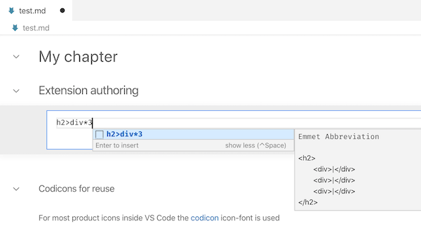
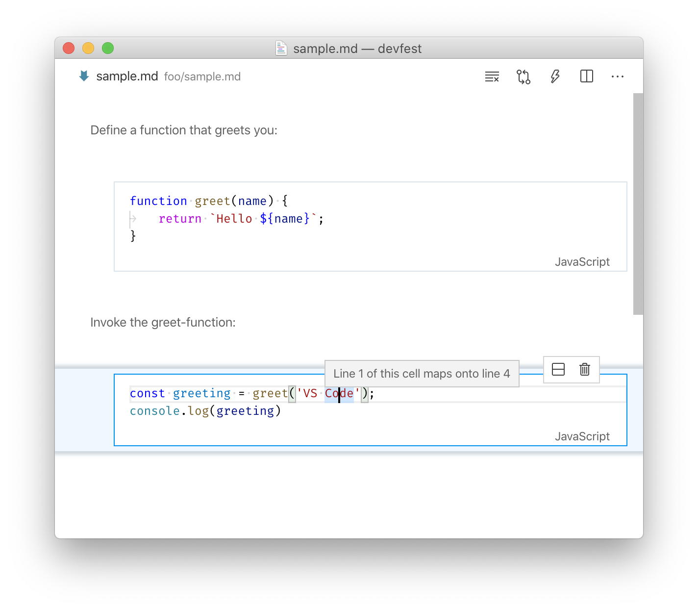

## Intro

This document is about language support for notebooks in VS Code. Notebooks consists of markdown and code cells. This guide is about code cells and focuses on language features, like IntelliSense or Reference Search. 

## Basics

A notebook document consits of different cells and each cell is associated with a text document (`vscode.NotebookCell#document`). Cell documents are ordinary text documents (`vscode.TextDocument`) and are visible and accessible to other extensions. Also, cells that are being edited have an assicated text editor (`vscode.TextEditor`) which again is visible and accessiblie to other extensions. 

This design has the advantage that many extensions just work. For instance, popular extensions like VIM, bracket colorizers, or spell-checkers work without knowing that they operate on a notebook cell. Also simple language extensions, like Emmet (see capture bolow) or snippets, work without any tweaks. 



## Notebooks define context

The previous section showed how notebook cells are ordinary documents and how that enables existing extensions for notebooks. This section is about more complex language features, esp. those that operate across "files", like reference search, rename, or diagnostics. 

A requirement of cross-file features is to know on what files to operate on, e.g. reference search must know in what files it should search. Various solutions to define such context exists and it depends on the programming language and tooling. Samples are project files like `csharp.proj`, explicit references like triple-slash-references, or using the underlying file system structure. Notebooks should be considered to be another case for defining context, e.g. reference search triggered inside a code cell should consider all notebook cells as its search context. 

The code snippet below is a sample of a notebook being a search context. It implements text based reference search for notebooks by searching for the current word in all notebook cells. Note how the provider registers for all languages (`*`) but narrows down on the `vscode-notebook-cell`-scheme - that denotes cell documents. Requests are always made against a cell from which the "notebook context" is derived, similar to deriving a TypeScript project from a file path. 

```ts
// text-based reference search
const selector = { 
	scheme: 'vscode-notebook-cell', // only notebook cells
	language: '*' 
};
vscode.languages.registerReferenceProvider(selector, new class implements vscode.ReferenceProvider {

		provideReferences(document: vscode.TextDocument, position: vscode.Position) {
			// (1) check for search word
			const range = document.getWordRangeAtPosition(position);
			const word = range && document.getText(range);
			if (!word) {
				return undefined;
			}
			// (2) get notebook for the cell-document (TODO: vscode must have simple API for this)
			const notebook = vscode.notebook.notebookDocuments.find(notebook => notebook.cells.find(cell => cell.document === document))!;
			const result: vscode.Location[] = [];
			// (3) search for word in all cells
			for (let cell of notebook.cells) {
				for (let range of this._findAll(word, cell.document)) {
					result.push(new vscode.Location(cell.uri, range))
				}
			}
			return result;
		}

		// all ranges at which word occurres
		private * _findAll(word: string, document: vscode.TextDocument) {
			const text = document.getText();
			let idx = 0;
			while ((idx = text.indexOf(word, idx)) > 0) {
				const start = document.positionAt(idx);
				const end = start.with({ character: start.character + word.length });
				yield new vscode.Range(start, end);
				idx += word.length
			}
		}
	}
)
```

The sample above implements text-based reference search but the stateless way of doing that is unlikely to be chosen for "real" reference search. Instead of reading cell documents over and over again (as it is done in `_findAll`) it is more likely that symbols are cached and only recomputed when things change. Usually, such changes are 'file is deleted', 'file is added', and 'file is changed'. For notebooks this means 'cell is removed', 'cell is added', and 'cell is changed'. The following APIs allow to observe said changes:

* `vscode.notebook.onDidChangeNotebookCells` - An event that fires when cells are removed from a notebook or when cells are added.
* `vscode.workspace.onDidChangeTextDocument` - Notebook cells are just text documents which means the `onDidChangeTextDocument` event fires when a notebook cell changes

In addition, there are events that fire when a notebook is opened and closed. Those events are

* `vscode.notebook.onDidOpenNotebookDocument` - Fires when a notebook is opened
* `vscode.notebook.onDidCloseNotebookDocument` - Fires when a notebook is closed, e.g when the last editor for a notebook is closed.

The following sample shows how to use these events. Each newly opened notebook is being validated (`onDidOpenNotebookDocument`). Validation is a simple error to the last cell telling you to add another cell (`validateNotebook`). That logic requires to re-validate the notebook when cells are added or removed (`onDidChangeNotebookCells`). Last, when a notebook is closed things are cleaned up again (`onDidCloseNotebookDocument`).

```ts
const diagnosticsByNotebook = new Map<vscode.NotebookDocument, vscode.DiagnosticCollection>()

// find last code cell and add error, clear error when there is none
function validateNotebook(notebook: vscode.NotebookDocument) {
	const diagnostics = diagnosticsByNotebook.get(notebook)!;
	const last = notebook.cells.filter(cell => cell.cellKind === vscode.CellKind.Code).pop();
	diagnostics.clear();
	if (last) {
		diagnostics.set(last.uri, [new vscode.Diagnostic(new vscode.Range(0, 0, 1, 0), 'One more cell and you\'ll be fine')])
	}
}
vscode.notebook.onDidOpenNotebookDocument(notebook => {
	// first time for this notebook
	const diagnostics = vscode.languages.createDiagnosticCollection();
	diagnosticsByNotebook.set(notebook, diagnostics);
	validateNotebook(notebook);
});
vscode.notebook.onDidChangeNotebookCells(event => {
	// cell added or removed
	validateNotebook(event.document);
});
vscode.notebook.onDidCloseNotebookDocument(notebook => {
	// last time for this notebook
	const diagnostics = diagnosticsByNotebook.get(notebook)!;
	diagnostics.dispose();
	diagnosticsByNotebook.delete(notebook);
});
```
In short, for a language service a notebook should be considered equal to a project in terms of defining context to which cross-file operations are scoped to. What is different to normal projects is that a code cell is like a file but it isn't path-addressable, e.g. it is only part of a file on disc and not a separate file. That means a requirement for a "notebook-ready" language service is that it must be able to work with "virtual" files.

### Concat-Document Helper

A notebook defines context and a cell is like a file in an "ordinary" project. This concept is simple but not always easy to support. Existing language services often require files to live on disk or files that aren't on disk cannot belong to a project. For such cases the `NotebookConcatTextDocument` exists - it projects selected code cells of a notebook onto a single document and offers utilities to map positions from cell documents to concat documents and vice versa.

The following snippets uses a concat document to implement a hover that shows the cumulative line number of all javascript cells of a notebook. It uses the `positionAt`-function to map an uri and position of a cell onto a position in the concatenated document. The sample doesn't show the reverse direction. That would be `locationAt` - mapping a position onto a cell uri and cell position.

```ts
vscode.notebook.onDidOpenNotebookDocument(notebook => {
	const concatDoc = vscode.notebook.createConcatTextDocument(notebook, { language: 'javascript' });
	vscode.languages.registerHoverProvider(
		{ scheme: 'vscode-notebook-cell', language: 'javascript' },
		new class implements vscode.HoverProvider {
			provideHover(document: vscode.TextDocument, position: vscode.Position) {
				const concatPosition = concatDoc.positionAt(new vscode.Location(document.uri, position));
				return new vscode.Hover(`Line ${position.line} maps onto line ${concatPosition.line}`);
			}
		}
	);
	//skipped for brevity: dispose concatDoc and hover provider when notebook closes
});
```



The first code cell has three lines and the first line of the second cell is the fourth line of the concatenated document. Other useful functions of the concat document are:

- `contains` - check if document is part of this concat document
- `onDidChange` - an event that fires when the concat document is affected by a change in the underlying notebook
- `dispose` - frees resources and disconnects the concat document from the underlying notebook
- `locationAt` - map a concat position onto a cell location
- `positionAt` - map a cell location onto a concat position
- `getText` - the concatenated value as string

Note that a concat document itself has no representation on disc and that it is not part of the list of text documents (`vscode.workspace.textDocuments`) but a helper construct only. It needs custom logic to integration with an existing language service.

### REPL vs Language Service
// notebooks cells might require massage or special treatment (REPL vs language service)

### Exclusive Language Features

Notebook cells are ordinary text documents and that enables re-use of existing extensions and language features. This openness is wanted and at the core of VS Code extensions. However, there might be cases in which 3rd party languages features don't work well when that language is "embedded" as a notebook cell. When this happens it might be because an existing language is re-used too generalised and the recommendation for that is to use a different language identifier. For instance, instead of `html` a notebook provider can assign the `html-nb` language to its cells. That doesn't guarantee exclusiveness but expresses the contexts in which these document appear clearly. 

The assignment of languages is done by the `NotebookContentProvider` during opening of a notebook document. Each cell can have a different language and it is defined via `vscode.NotebookCellData#language`.
